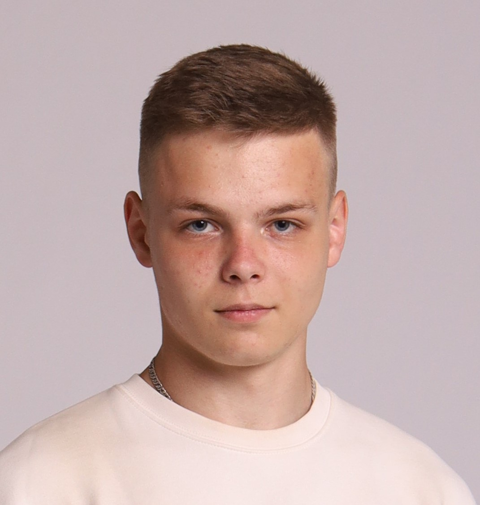

 

# Artsiom Zakhareuski

## My Contact Info

* **Phone:** +375 (44) 753-48-01
* **E-mail:** [artemzaharevsky@gmail.com](artemzaharevsky@gmail.com)
* **LinkedIn:** [Artsiom Zakhareuski](https://www.linkedin.com/in/azaaaart/)
* **GitHub:** [ArtemZahareuski](https://github.com/ArtemZahareuski)
* **Discord** [ArtemZaharevski#2424](ArtemZaharevski#2424)

## Summary 

My name is Artem, I'm 21 years old and I'm a front-end developer. I love to travel, play sports. My hobbies are board games. The desire to understand how modern technologies are arranged inside brought me to the IT sphere. I was interested in front-end development because I always wanted to create web applications, as well as create a visual. Now I study a lot and try to improve my skills by reading various articles, watching video tutorials and of course practicing. I take English courses to improve my level as well.

## Skills 

* HTML
* CSS
* JavaScript (fundamentals, ES6+, DOM)
* Sass, Scss
* ReactJs (beginner)
* MySQL
* Git & GitHub
* Editor: WebStorm, **VSCode**

## Code Example

```js
function Example(array) {
  let result = array.map(item => item ** 2);
  return result;
}
```

## Work Experience

**Beltelecom | 2022 (3 month)**
Undergraduate practice. Development of a web application for customer accounting. Stack: HTML,CSS, JavaScript, PHP, SQL.

## Education 

* **Belarusian State Academy of Communications**
  * Telecommunications specialist
2019/2022
* **Belarusian State University of Informatics and Radioelectronics**
  * Bachelor, Telecommunications Engineer
2023/2028
* **RSSchool JavaScript/Front-end 2023Q4 | (4 month)**
  * Front-end development with use HTML/CSS/JavaScript and other technologies **(only the first stage is completed)**

## English 

**B1+ (Intermediate)**. completed course at a foreign language school _English Papa_. I visit speaking club as well for improve my speaking skills.

## Certificates

* [English Papa course](../../Certificate.pdf): **B1+ (Intermediate)**


